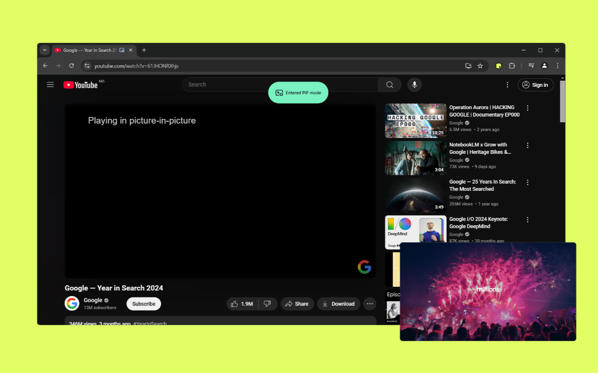

<p align="center">
 
 <h1 align="center">PIPX</h1>
 <p  align="center">Better Picture-in-Picture experience</p>
 
</p>

[](https://chromewebstore.google.com/detail/nkbikckldmljjiiajklecmgmajgapbfl)

## Description

A simple Chrome Extension that automatically opens [Picture-in-Picture](https://wicg.github.io/picture-in-picture/) when switching tabs or by using the (`Alt+P`) shortcut.

**Important Notes**

- Automatic Picture-in-Picture for embedded videos from different websites may be limited by browser security policies (see the [Limitations](#limitations) section for details).
- Activating Picture-in-Picture on tab switch might require prior interaction with the video due to browser security requirements (see the [Limitations](#limitations) section for details).

## Features

- Automatic PiP on tab switch.
- Toast notifications to provide visual feedback to users.
- Enable PiP using the (`Alt+P`) shortcut or by clicking the extension icon.

> [!TIP]
>
> 1. The (`Alt+P`) shortcut can be changed on the Chrome Extension Shortcuts settings page: [chrome://extensions/shortcuts](chrome://extensions/shortcuts).
> 2. To disable toast notifications (enabled by default) click right on the extension icon then click on Show/Hide notifications.

## Limitations

> [!important]
> Detection and automatic Picture-in-Picture (PiP) activation for embedded video elements are subject to the following browser security policies and API requirements.

- **Same-Origin Policy:** This fundamental web security measure prevents JavaScript code running on one domain from directly accessing the content of another domain. Consequently, this extension **cannot directly access** video elements embedded via `<iframe>` elements from different origins (e.g., YouTube, Vimeo, Dailymotion) or within cross-origin Shadow DOMs. This limitation may prevent automatic PiP from working on such embedded videos.

- **User Interaction Requirement for PiP on Tab Switch:** For security reasons, the browser's Picture-in-Picture API generally requires explicit user interaction (like a click) with the video element on the page before programmatic PiP can be initiated, especially when triggered by events like a tab switch. This means that even for same-origin videos, automatic PiP upon switching tabs might not always be possible without prior user interaction with the video.

**In summary, the ability of this extension to automatically detect and activate Picture-in-Picture on video elements is subject to browser security restrictions. Users might need to manually trigger PiP in certain scenarios (through MediaSession interface), particularly for embedded cross-origin videos or when attempting to activate PiP on tab switch without prior interaction.**

## Notifications guide

#### 1. Entered/Exited PiP mode

This notification is shown when the PiP is successfully enabled/disabled.

It is only shown when using the (`Alt+P`) shortcut or by clicking the extension icon.

#### 2. Can not enter PiP mode

This notification is shown when :

- The video is paused or muted.
  > to enable PiP make sure the video is playing and is not muted.
- Many videos are playing and not mute at the same time.
- No videos were found.

#### 3. Failed to enter PiP mode

This notification is shown when entering PiP mode encountered an error, check your console for more info and do not hesitate to [file an issue](https://github.com/phrechu/PIPX/issues).

## Roadmap

- [x] `v0.0.1`
  - [x] Feat: autoPiP on tab switch.
  - [x] Feat: Enable PiP by clicking the PIPX icon or using Alt-P shortcut.
  - [x] Feat: Toast notifications for visual feedback.
  - [x] Publish to Chrome Web Store.
- [x] `v0.1.0`
  - Feat: Add video detection for nested browsing contexts (e.g iframe elements / reddit player).
  - Docs: Add limitations section to README.
- [ ] `v0.2.0`
  - Feat: Automate Publishing new versions.
- [ ] `v0.3.0`
  - Feat: Improve the notifications UI and messages.
- [ ] `v1.0.0`
  - Release: Mark core functionality as stable and address known limitations.

## Development

You must use [pnpm](https://pnpm.io/) with this repo.

Install dependencies:

```sh
pnpm i
```

### Scripts

This extension is bundled via [WXT](https://wxt.dev).

- `pnpm dev`: To Launch Chrome with the dev version of the extension installed.
- `pnpm build`: To build the extension for production. Outputs to the `dist` directory.
- `pnpm zip`: To zip up the `dist` directory into an installable ZIP file.

### Install Locally

```sh
pnpm build
```

- Go to [chrome://extensions/](chrome://extensions/).
- Turn on developer mode.
- Click "load unpacked" button.
- Choose the `.output/chrome-mv3/` folder.
- Then you will be able to see extension icon in Chrome extension bar.
